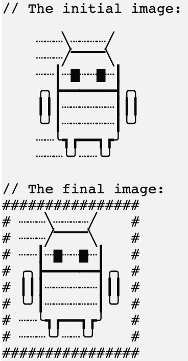

En esta tarea, implementaremos uno de los filtros.

### Tarea

Implementa la función `applyBordersFilter`. 
Para el símbolo del borde, por favor usa la variable predefinida `borderSymbol`, que almacena `#`:
```kotlin
println(borderSymbol) // #
```

<div class="hint" title="Haz clic para ver un ejemplo del funcionamiento de la función applyBordersFilter">

Aquí tienes un ejemplo del funcionamiento de la función:
<p>
    
</p>
</div>

Para hacer la imagen más atractiva, añade un separador entre la imagen y el borde. 
Para el separador, por favor usa la variable predefinida `separator`, que almacena un espacio.
```kotlin
println("Este es el valor de la variable separator: $separator.") // Este es el valor de la variable separator:  .
```

**Nota que la imagen podría no ser un cuadrado, lo que significa que el ancho de las diferentes líneas en la imagen puede variar.**
En otras palabras, necesitas rellenar las líneas más cortas con el `separator` para hacer la imagen cuadrada.
Para obtener el ancho de la imagen, puedes usar la función predefinida `getPictureWidth`, 
que devuelve la longitud máxima de todas las líneas de la imagen.

<div class="hint" title="Haz clic para ver un ejemplo del funcionamiento de la función getPictureWidth">

```kotlin
val pictureWidth = getPictureWidth(picture) // calcula la línea más larga de la imagen y devuelve su longitud
```

Además, el proyecto ya almacena la variable `newLineSymbol`, que puede usarse para añadir nuevas líneas entre las líneas de imagen recién generadas, por ejemplo:
```kotlin
val line1 = "#######"
val line2 = "#######"

val line3 = "$line1$newLineSymbol$line2"
println(line3)
```

El resultado será:
```text
#######
#######
```
</div>

Si tienes alguna dificultad, **las pistas te ayudarán a resolver esta tarea**.

----

### Pistas

<div class="hint" title="Haz clic para ver varios ejemplos de cómo debería funcionar la función applyBordersFilter">

Primer ejemplo:


Segundo ejemplo:


</div>

<div class="hint" title="Haz clic para aprender cómo ejecutar la función applyBordersFilter con imágenes predefinidas">

Para comprobar cómo funciona tu función, puedes ejecutarla en <code>main</code> pasando una de las imágenes predefinidas:

```kotlin
fun main() {
  applyFilter(simba, "borders")   // un ejemplo con la imagen de simba
  applyFilter(monkey, "borders")  // un ejemplo con la imagen de monkey
  applyFilter(android, "borders") // un ejemplo con la imagen de android (esta imagen tiene longitudes de línea diferentes)
}
```
</div>

<div class="hint" title="Haz clic para obtener una pista sobre cómo calcular la longitud de los bordes superior e inferior para la nueva imagen">

La longitud de los bordes superior e inferior del borde será 4 caracteres más que el ancho de la imagen inicial, 
ya que añadimos el <code>borderSymbol</code> y el <code>separator</code> en ambos lados de la imagen.
</div>

<div class="hint" title="Haz clic para aprender cómo implementar la función getPictureWidth por tu cuenta">

  Si lo deseas, puedes intentar implementar tu propia versión de la función `getPictureWidth`: 
  divide la imagen utilizando la función <a href="https://kotlinlang.org/api/latest/jvm/stdlib/kotlin.text/lines.html">`lines`</a> 
  y luego usa la función <a href="https://kotlinlang.org/api/latest/jvm/stdlib/kotlin.text/max-of-or-null.html">`maxOfOrNull`</a> para calcular 
  la longitud máxima de las líneas de la imagen.   
</div>