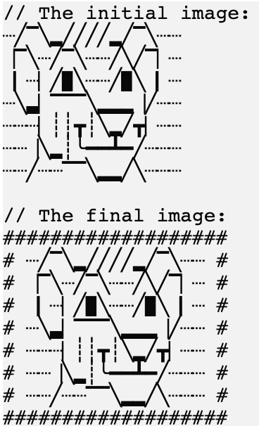

En esta tarea, definiremos las _firmas_ de varias funciones e implementaremos una de ellas.

### Tarea

Agrega varias funciones al juego:

- _applyBordersFilter_, que toma un argumento de tipo cadena, `picture`,
  y devuelve una nueva imagen con el filtro aplicado.
  Por ahora, no necesitas implementar completamente esta función. En su lugar, es suficiente usar la función `TODO`
  como un marcador de posición para una futura implementación.
  Implementaremos esta función al resolver tareas posteriores.

<div class="hint" title="Haz clic para ver la firma de la función applyBordersFilter">

La firma de la función es:
```kotlin
fun applyBordersFilter(picture: String): String
```
</div>

<div class="hint" title="Haz clic para ver un ejemplo del filtro de bordes al completar el proyecto">

Un ejemplo de este filtro:
<p>
    
</p>

</div>

- _applySquaredFilter_, que toma un argumento de tipo cadena, `picture`,
  y devuelve una nueva imagen con el filtro aplicado.
  Por ahora, no necesitas implementar completamente esta función. En su lugar, es suficiente usar la función `TODO`
  como un marcador de posición para una futura implementación.
  Implementaremos esta función al resolver tareas posteriores.

<div class="hint" title="Haz clic para ver la firma de la función applySquaredFilter">

La firma de la función es:
```kotlin
fun applySquaredFilter(picture: String): String
```
</div>

<div class="hint" title="Haz clic para ver un ejemplo del filtro cuadrado al completar el proyecto">

Un ejemplo de este filtro:
<p>
    
</p>

</div>