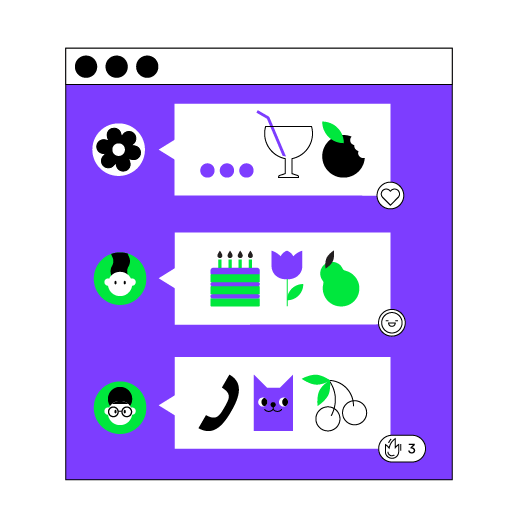

Esta lección se centra en los temas que cubriste en la lección anterior. La diferencia principal es que esta lección no contiene una parte teórica; solo necesitas implementar el proyecto desde cero por ti mismo. ¡No tenemos dudas de que tendrás éxito!

<p align="center">
    
</p>

El proyecto de esta lección es **Chat**. 
El propósito de este juego es hacerle preguntas al usuario para conocerlo mejor.

Escribe una aplicación de consola
que se comunique con el usuario en un formato de diálogo interactivo:

```text
- ¡Hola! ¡Me alegra conocerte, déjame conocerte mejor! ¿Cómo te llamas?
- <respuesta del usuario>
- ¡Encantado de conocerte, <respuesta del usuario>! ¡Mi nombre es Kotlin Bot! Soy un lenguaje de programación joven creado en 2010. ¿Cuántos años tienes?
- <respuesta del usuario>
- ¡<edad del usuario> es genial! ¡Espero que completes este curso exitosamente! ¡Cualquiera puede aprender programación a cualquier edad!
```

Un ejemplo de la aplicación final:

