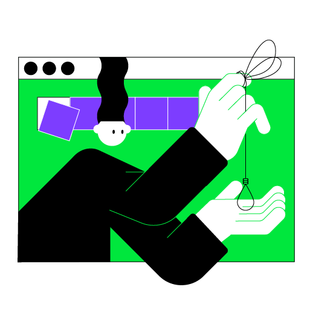

Esta lección se centra en los temas que cubriste en la lección anterior. La principal diferencia es que el proyecto final no estará dividido en etapas intermedias y puedes intentar implementarlo por completo desde cero. ¡No dudamos de que tendrás éxito!

----

    

### descripción del proyecto

El proyecto de esta lección es **Ahorcado**. El propósito de este juego es adivinar la palabra elegida por la computadora. Puedes intentar implementar todo el juego por tu cuenta; sin embargo, si necesitas ayuda, consulta las pistas.

### ejemplo del proyecto

