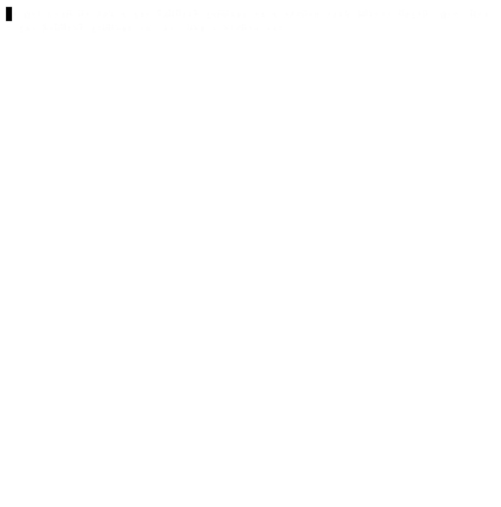

En este paso, necesitas completar la aplicación.

### Tarea

Implementa la función `applyGenerator`, que acepta `pattern`, `generatorName`, `width` y `height`, luego recorta el `pattern`, y finalmente, aplica la función `canvasGenerator` o `canvasWithGapsGenerator`.

<div class="hint" title="Haz clic aquí para ver la nueva firma de la función applyGenerator">

La firma de la función es:
```kotlin
fun applyGenerator(pattern: String, generatorName: String, width: Int, height: Int): String
```
</div>

Los valores posibles para el argumento `generatorName` son:

- `canvas` – llama a la función `canvasGenerator`
- `canvasGaps` - llama a la función `canvasWithGapsGenerator`

La función `applyGenerator` debe lanzar un error para alertar al usuario sobre un nombre de filtro inesperado.

<div class="hint" title="Haz clic aquí para ver el ejemplo del proyecto generador de patrones">

  

</div>

Además, se comprobará la función `main` - simplemente descomenta el código en la función `main`.

¡Buena suerte!