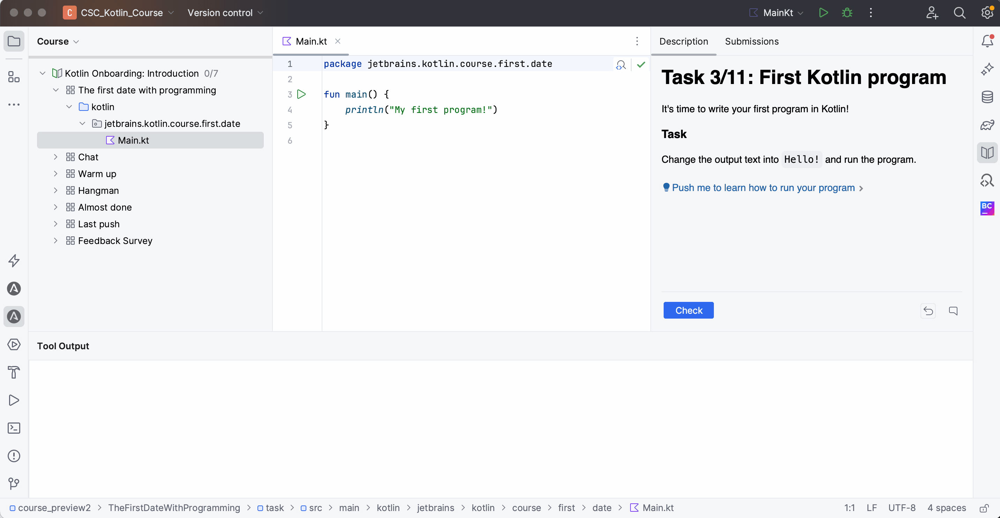

¡Es hora de escribir tu primer programa en Kotlin!

### Tarea

Cambia el texto de salida a `¡Hola!` y ejecuta el programa.

Para ejecutar tu programa, necesitas abrir el archivo `Main.kt` y hacer clic en el **triángulo verde** cerca de la función `main`. 
Luego, la salida del programa se mostrará en la consola:

