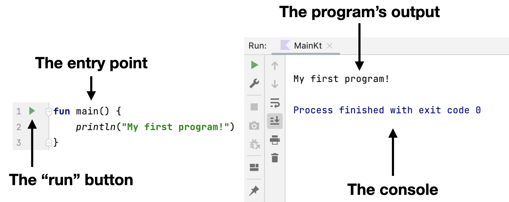

Todo programa escrito en cualquier lenguaje de programación tiene un **punto de entrada**. Como regla general, es una sección especial en el programa que controla todas las operaciones posteriores.

En Kotlin, el [punto de entrada](https://kotlinlang.org/docs/basic-syntax.html#program-entry-point) es la función especial `main`, que se ve así:
```kotlin
fun main() {
    // Algún código aquí
}
```

Todo lo que sucede _dentro_ de la función (entre las llaves) se ejecutará mientras el programa se ejecuta. Esta función se puede colocar en _cualquier_ archivo de tu proyecto; incluso puedes añadir _varias_ funciones `main` a un proyecto. En este último caso, puedes elegir qué punto de entrada ejecutar.

Para `ejecutar` un programa, debes hacer clic en el **triángulo verde** al lado de la función `main`, y luego el resultado del programa se mostrará en la _consola_ dentro del IDE:

